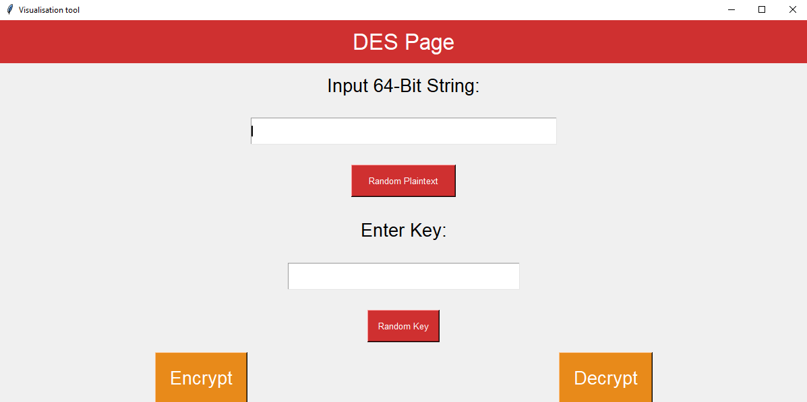

# Block Cipher Visualisation Tool

---
Block Cipher Visualisation Tool is a program that visualises the steps taken by the AES and
DES block ciphers to encrypt and decrypt data.

### Background

---
Cryptography is of major importance in the digital world of today as it ensures secure
communication between two parties. Students have been known to find learning cryptography difficult
for several reasons: lack of strong mathematical background or low attendance to cryptography classes.
Block ciphers have many substitutions and permutations that can be difficult to learn. Other block
cipher visualisation tools show too much information on the screen, and this can confuse new students
with no previous knowledge of cryptography.

### Rationale

---
To create a visualisation tool that will demonstrate visually the steps taken to encrypt and decrypt
data with several block ciphers, mainly AES and DES, as well as their corresponding modes of operation,
e.g., CBC and ECB mode. By being able to view the data move through the different substitutions and
permutations, students should be able to understand block ciphers more easily. The program will show
the different key procedures performed on the data on the way to being encrypted/decrypted and finally
will show the result of the cipher.

### Features

---
- Simple Design that anyone can follow
- Interactive as users can enter values
- No need for internet access to use

### Screenshots

---

### Technologies

---
- Python
- TKinter Library

### Project Structure

---
The main folder contains all the files necessary to run the application

1. [main.py](https://github.com/MBelegris/BlockCipherVisualisationTool/blob/master/main/main.py) 
contains the visual elements for the program- each class makes up a different page in
the program.
2. [DES_logic_func.py](https://github.com/MBelegris/BlockCipherVisualisationTool/blob/master/main/DES_logic_func.py)
contains all the functions necessary to encrypt and decrypt using the DES block cipher
3. [AES_logic_func.py](https://github.com/MBelegris/BlockCipherVisualisationTool/blob/master/main/AES_logic_func.py)
contains all the necessary functions to encrypt and decrypt using the AES block cipher
4. [images](https://github.com/MBelegris/BlockCipherVisualisationTool/tree/master/main/images)
folder contains all the images used in main.py
5. [Audio](https://github.com/MBelegris/BlockCipherVisualisationTool/tree/master/main/Audio)
folder contains all the audio used in main.py

### Usage

---
1. Clone the repository
2. Run the main.py